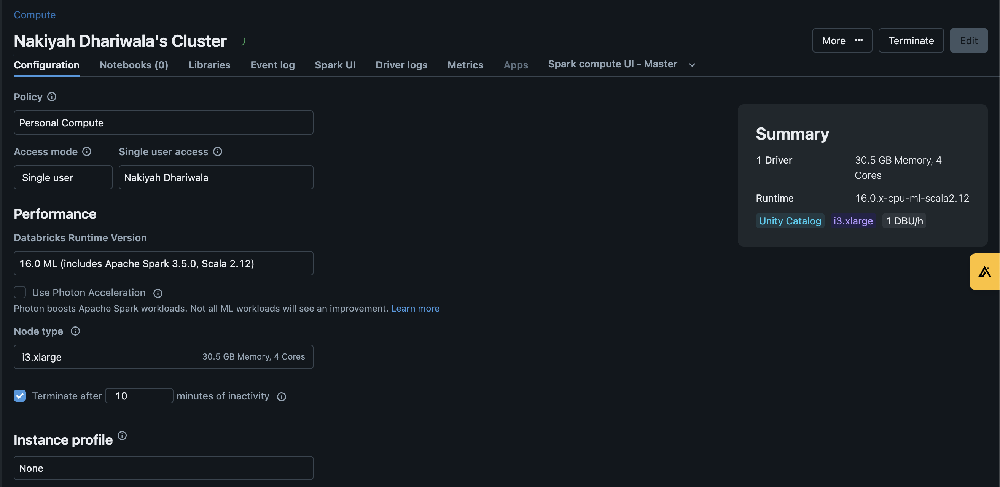
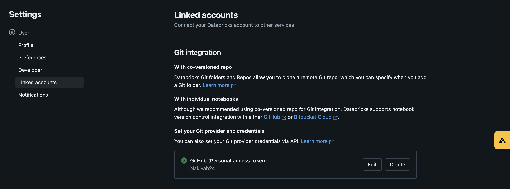
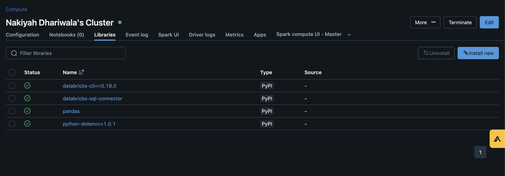
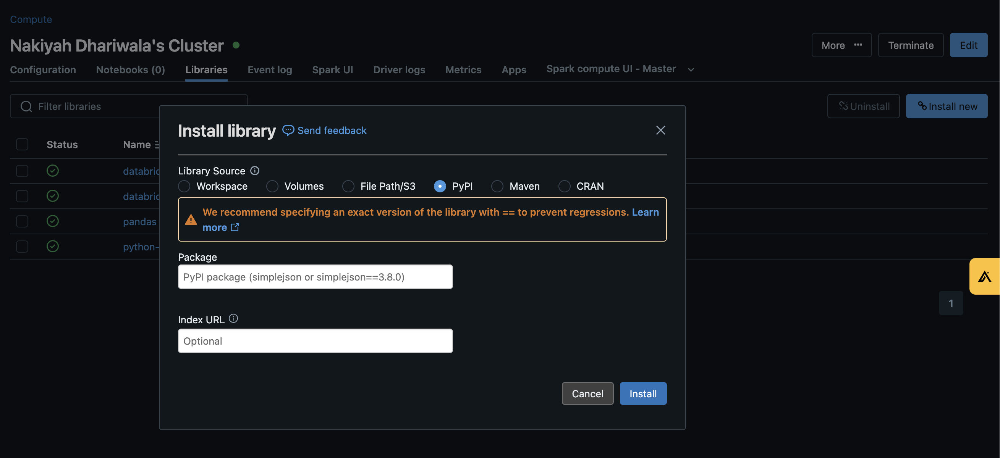
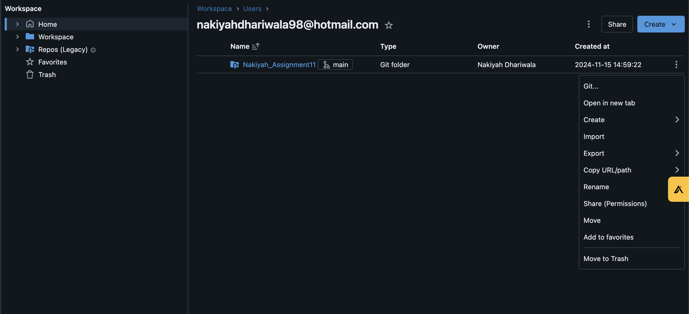
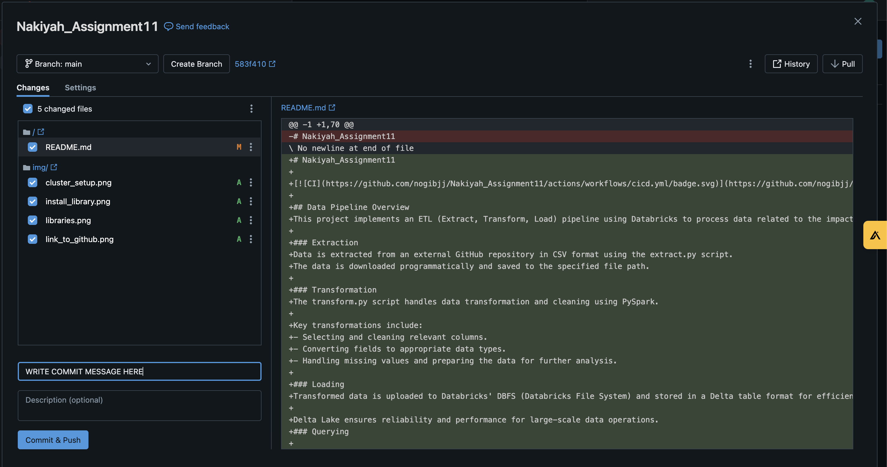

# Nakiyah_Assignment11

## Data Pipeline Overview
This project implements an ETL (Extract, Transform, Load) pipeline using Databricks to process data related to the impact of remote work on mental health. The ETL pipeline successfully extracts, transforms, and loads data into Databricks DBFS and Delta Lake. Users can perform SQL queries on the processed data, enabling easy access and insights into the impact of remote work on mental health. The pipeline involves the following steps:

### Extraction
Data is extracted from an external GitHub repository in CSV format using the extract.py script.
The data is downloaded programmatically and saved to the specified file path.

### Transformation
The transform.py script handles data transformation and cleaning using PySpark.

Key transformations include:
- Selecting and cleaning relevant columns.
- Converting fields to appropriate data types.
- Handling missing values and preparing the data for further analysis.

### Loading 
Transformed data is uploaded to Databricks' DBFS (Databricks File System) and stored in a Delta table format for efficient querying and analytics.

Delta Lake ensures reliability and performance for large-scale data operations.
### Querying

SQL queries are then executed against the Delta table using Spark SQL.
A logging mechanism tracks executed SQL queries for reproducibility and reference.

## Setting Up and working on the repository on Databricks
Follow these steps to set up and run the ETL pipeline on Databricks:

1. Clone the Repository in Databricks

- Create a repository on GitHub
- Import the repository into Databricks by
  - Going to Databricks Workspace > Repos > Add Repo
  - Selecting Git and enter your repository URL to clone it directly

2. Create a Cluster from the Compute tab in Databricks
- Click Create Cluster and configure the cluster to ensure the node terminates after 10 minutes of activity. You can keep everything else the same
  - Start the cluster after configuration.

3. Link Your Databricks Workspace to GitHub
- Go to your Databricks User Profile (click your profile icon).
- Click on Settings > Git Integration > Linked Accounts.
- Select GitHub and follow the prompts to authenticate and link your account.

4. Add Code to the Repository and Set Up the ETL Pipeline
- Use the Databricks notebook or workspace editor to:
  - Write or upload your extract.py, transform.py, and query.py scripts.
  - Place any additional files (e.g., configuration or data files) in the appropriate directories.

- Ensure paths in your scripts are updated to align with the DBFS (e.g., dbfs:/FileStore/your_path).

5. Install Required Libraries
- In your cluster configuration:
  - Navigate to the Libraries tab.
  - Click Install New > PyPI to add additional Python packages, such as python-dotenv, databricks-cli, and others required by your scripts.
- Alternatively, you can use %pip install commands directly in a notebook to install libraries on the fly.

6. Push Your Code to GitHub

Once you’ve made changes or added new scripts in Databricks, you can push the code back to your GitHub repository to maintain version control:

- Save and Commit Changes in Databricks
  - Navigate to your repository under Repos in Databricks.
  - Use the Databricks editor to save any changes made to your scripts or notebooks.
  - Commit Changes in Databricks

- Click on the 3 dots as shown in the image below

- Click on git and it will take you to the commit page

- Add a meaningful commit message summarizing your changes.
- Select Commit and Push change to GitHub

After committing, select Push to send your changes to the remote GitHub repository.

